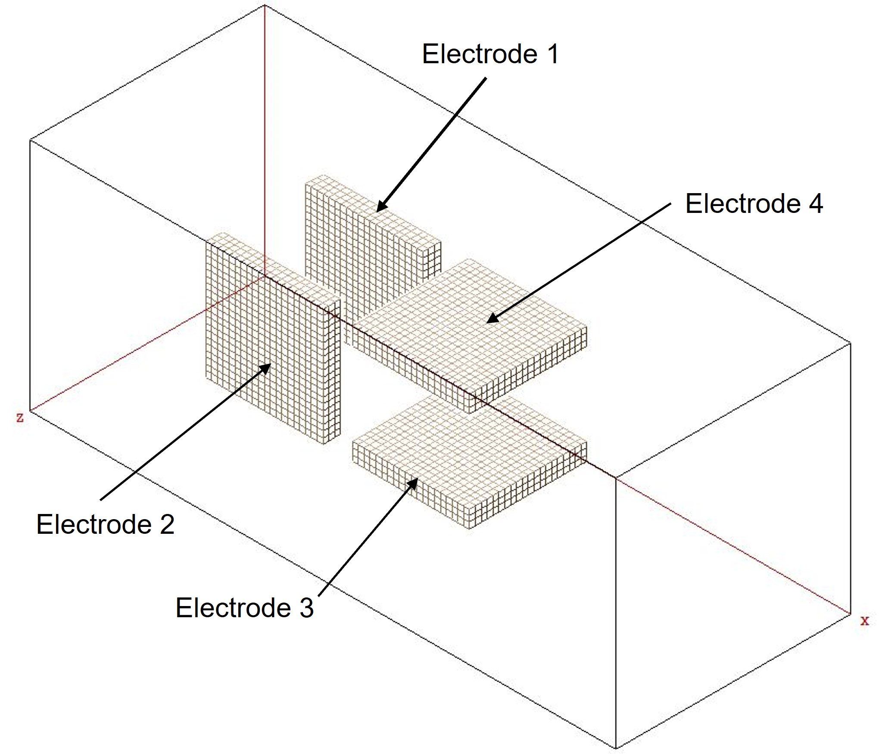

# SIMION-Examples

I have made this repo to store simple examples of SIMION code for reference. Ideally, I can add to this repo whenever I want to try a new method in SIMION on a toy model that I know works.

## Toy Model: Steering Plates

This geometry was coded from scratch in the `steeringPlates.gem` file. This simple model consists of two pairs of steering plates, one in the y-direction and the other in the z-direction. Electrodes 1 and 2 steer in the z-direction, and electrodes 3 and 4 steer in the y-direction. Each of the 4 electrodes can be individually biased. The refined PA is shown below:

<p align="center">

</p>

### Workbench: Steering Sweep

This workbench is set up to scan electrodes 1 and 3 and record all the initial and final (y,z) positions for each combination of voltages. Each run is saved as a .csv file in the `/data` directory. 
```
Each file has the naming convention: SteeringSweepData_V1_*XV_V3_*YV.csv
* is p or n denoting positive or negative polarity
X and Y are the absolute values of the voltage on V1 and V3 
```
The csv file contains a two-line header with the voltages and the column names followed by the inital and final y and z position of each ion in mm. 
